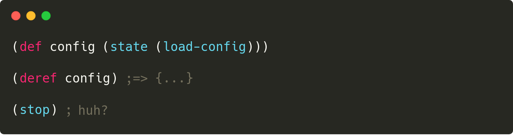

[](https://clojars.org/functionalbytes/redelay)
[](https://cljdoc.org/d/functionalbytes/redelay/CURRENT)
[](https://github.com/aroemers/redelay/actions?query=workflow%3A%22Clojure+CI%22)
[](https://clojars.org/functionalbytes/redelay)
[](https://functionalbytes.nl/clojure/redelay/rmap/2020/06/26/redelay.html)

# 🏖 redelay

A Clojure library for **state lifecycle-management** using **tracked** and **resettable** delays, inspired by [mount-lite](https://github.com/aroemers/mount-lite), decomplected from any methodology.



## Usage

This library allows you to easily start and stop the stateful parts of your application, such as database connections, web servers, schedulers and caches.
Being able to easily restart these in the right order makes REPL-driven development easier, faster and _more fun_.
This is also known as Stuart Sierra's [reloaded workflow](https://www.cognitect.com/blog/2013/06/04/clojure-workflow-reloaded).

With this library you create first class **State** objects.
Think of them as Clojure's [delay](https://clojuredocs.org/clojure.core/delay), but **resettable** and **tracked**.

### The basics

The API is very small.
All you need to require is this:

```clj
(require '[redelay.core :refer [state status stop]])
```

To create a State object you use the `state` macro, or the `defstate` macro as you'll see later on.
Let's create two states for our examples, the second one depending on the first one.

```clj
(def config
  (state (println "Loading config...")
         (edn/read-string (slurp "config.edn")))

(def db
  (state :start  ; <-- optional in this position
         (println "Opening datasource...")
         (make-datasource (:jdbc-url @config))

         :stop
         (println "Closing datasource...")
         (close-datasource this)))
```

Let's quickly inspect one of the states we have just created:

```clj
config
;=> #<State@247136[user/state--312]: :unrealized>

(realized? config)
;=> false
```

There are several things to note here.

- The expressions inside `state` are **qualified by a keyword**, such as `:start` and `:stop`.
- The first expression is considered to be the `:start` expression, if not qualified otherwise.
- All **expressions** are **optional**.
- An expression can consist of **multiple forms**, wrapped in an implicit `do`.
- The `:stop` expression has access to a **`this` parameter**, bound to the state's value.
- You can call `clojure.core/realized?` on a state, just like you can on a delay.

Now let's start and use our states.
Just like a delay, the first time a state is consulted by a `deref` (or `force`), it is realized.
This means that the `:start` expression is executed and its result is cached.

```clj
@db
Loading config...
Opening datasource...
;=> org.postgresql.ds.PGSimpleDataSource@267825

@db
;=> org.postgresql.ds.PGSimpleDataSource@267825

(realized? config)
;=> true
```

You can see that the `:start` expressions are only executed once.
Subsequent derefs return the cached value.

A state implements Java's `Closeable`, so you _could_ call `.close` on it.
This will execute the `:stop` expression and clear its cache.
Now the state is ready to be realized again.
This is where it differs from a standard delay.

However, **redelay keeps track of which states are realized and thus active.**
You can see which states are active by calling `(status)`:

```clj
(status)
;=> (#<State@247136[user/state--312]: {:jdbc-url "jdbc:postgresql:..."}>
;=>  #<State@329663[user/state--315]: org.postgresql.ds.PGSimpleDataSource@267825>)
```

Because the active states are tracked, you can easily stop them all by calling `(stop)`.
All the active states are stopped (i.e. closed) in the **reverse order of their realization**.
So while you can call `.close` on the individual states, oftentimes you don't need to.

```clj
(stop)
Closing datasource...
;=> (#<State@329663[user/state--315]: :unrealized>
;=>  #<State@247136[user/state--312]: :unrealized>)
```

So **no matter where your state lives**, you can reset it and start afresh.
Even if you've lost the reference to it.

Oh, two more things.
If an active state's `:stop` expression has a bug or can't handle its value, you can always force it to close with `close!`.
And if you want to inspect the value of a state, without starting it, you can use Clojure's `peek` on it.

### Naming and defstate

Next to the `:start` and `:stop` expressions, you can pass a `:name` to the `state` macro.
This makes recognizing the states easier.
The `:name` expression must be a symbol.

```clj
(def config (state (load-config) :name user/config))
;=> #'user/config

config
;=> #<State@19042[user/config]: :unrealized>
```

If you bind your state to a global var, it is common to have the name to be equal to the var it is bound to.
Therefore the above can also be written as follows:

```clj
(defstate config (load-config))
```

Users of [mount](https://github.com/tolitius/mount) or [mount-lite](https://github.com/aroemers/mount-lite) will recognize above syntax.
Trying to redefine a `defstate` which is active (i.e. realized) is skipped and yields a warning.

#### Some other details

The `defstate` macro supports metadata on the name symbol.
Note that this metadata is set on the var.
If you want **metadata** on the State object, you can use `:meta` expression inside `state`, or use Clojure's `alter-meta!` or `reset-meta!` on it.
So a full `defstate` could look like this:

```clj
(defstate ^:private my-state
  :start (start-it ...)
  :stop  (stop-it this)
  :meta  {:my-meta-score 42})
```

Next to metadata support, Clojure's `namespace` and `name` functions also work on states.
This may yield an easier to read status list for example:

```clj
(map name (status))
;=> ("config")
```

### Testing your application

Since state in redelay is handled as first class objects, there are all kinds of testing strategies.
It all depends a bit on where you keep your State objects (discussed in next section).

For the examples above you can simply use plain old `with-redefs` or `binding` to your hearts content.
The `binding` is possible for states created with `defstate`, as those are declared as dynamic for you.

We can redefine "production" states to other states, or even to a plain `delay`.
There is **no need for a special API** to support testing.
For example:

```clj
(deftest test-in-memory
  (binding [config (delay {:jdbc-url "jdbc:derby:..."})]
    (is (instance? org.apache.derby.jdbc.ClientDataSource @db))))
```

Another option is to use Clojure's `with-open`, since states implement `Closeable`:

```clj
(deftest test-in-memory
  (with-open [db (state (make-datasource "jdbc:derby:..."})
    (is (instance? org.apache.derby.jdbc.ClientDataSource @db))))
```

You could add a fixture in your test suite, ensuring `(stop)` is always called after a test.

Again, these are just examples.
You may structure and use your states completely different, as you'll see next.

### Global versus local state

The examples above have bound the states to global vars.
This is not required.
**State objects can live anywhere** and can be passed around like any other object.
A less global approach using a map of states for example - either dereferenced or not - is perfectly feasible as well.

By its first class and unassuming nature this library aims to support **the whole spectrum** of [mount](https://github.com/aroemers/mount-lite)-like global states to [Component](https://github.com/stuartsierra/component)-like system maps to [Integrant](https://github.com/weavejester/integrant)-like data-driven approaches.
This is also the reason that redelay **does not have some sort of "start" or "init" function**.
You can easily add this to your application yourself, if you cannot to rely on derefs alone.

By the way, if you prefer system maps, have a look at **the [rmap](https://github.com/aroemers/rmap) library**, as it combines well with redelay.

### Extending redelay

The redelay library is **minimal on purpose**.
It's just the the State object and the two basic management functions `(status)` and `(stop)`.
Those two functions are actually implemented using the library's extension point: **the watchpoint**.

The library has a public `watchpoint` var.
You can watch this var by using Clojure's `add-watch`.
The registered watch functions receive `:starting`, `:started`, `:stopping` or `:stopped` and the State object.

You can do all kinds of things with this watchpoint, such as logging or keeping track of states yourself.
So if you want to have more sophisticated stop logic with separate buckets/systems of states using their metadata for example?
Go for it, be creative and use the library's building blocks to fit your perfect workflow!

_That's it for simple lifecycle management around the stateful parts of your application. Have fun!_ 🚀

## License

Copyright © 2020-2024 Functional Bytes

This program and the accompanying materials are made available under the
terms of the Eclipse Public License 2.0 which is available at
http://www.eclipse.org/legal/epl-2.0.

This Source Code may also be made available under the following Secondary
Licenses when the conditions for such availability set forth in the Eclipse
Public License, v. 2.0 are satisfied: GNU General Public License as published by
the Free Software Foundation, either version 2 of the License, or (at your
option) any later version, with the GNU Classpath Exception which is available
at https://www.gnu.org/software/classpath/license.html.
